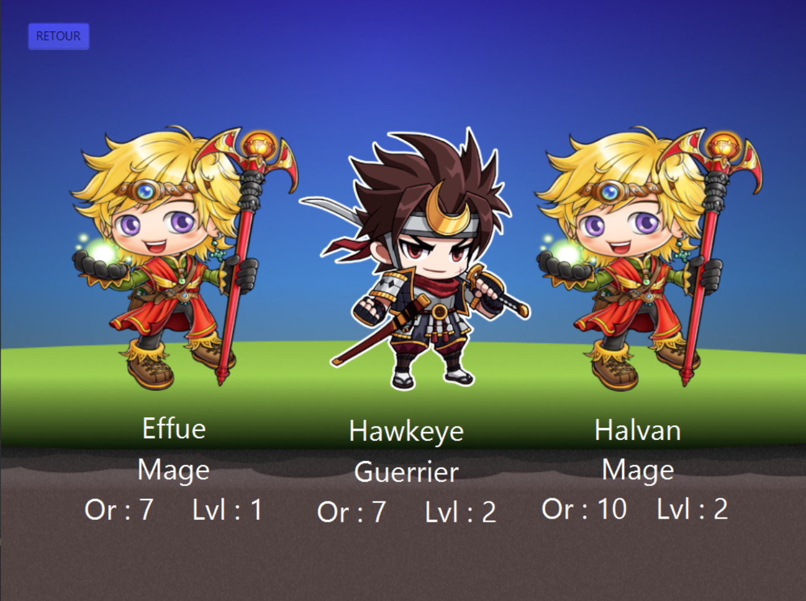
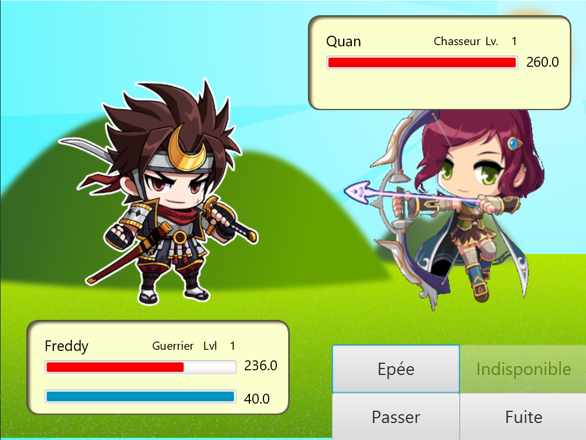
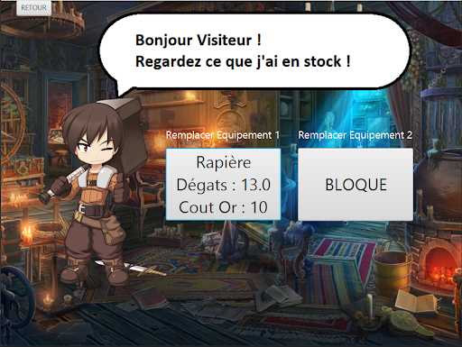
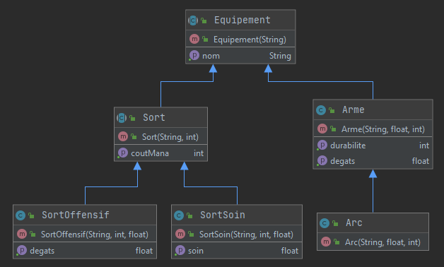
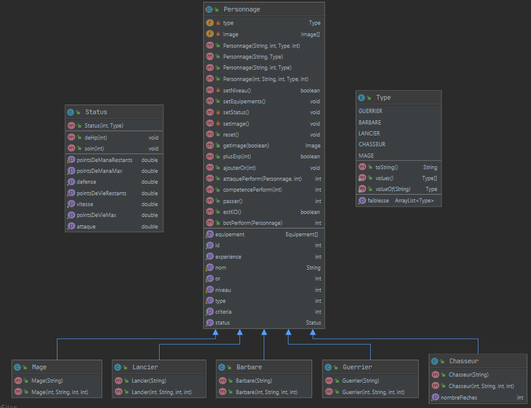

<h1 align="center"> Legend of the Secret : Ultimate Clicker Vip Edition Deluxe </h1> 

     

<strong> Mini RPG de combat tour par tour en JavaFX </strong>

>## Description générale du jeu

Il s’agit d’un classique mini RPG de combat tour par tour dans lequel peut s’affronter 5 classes : Les Guerriers, les Lanciers, les Barbares, les Chasseurs et les Mages.    
Le système de combat tactique est le Triangle des Armes. En effet, les guerriers possèdent des épées, les lanciers des lances et les barbares possèdent des haches.   
Ainsi, on peut définir des forces et des faiblesses entre les classes : L’épée est plus forte que la hache, la hache est plus forte que la lance, et la lance est plus forte que l’épée.    
Quant aux deux autres classes, elles sont toutes les deux vulnérables aux trois premières classes, comme elles ne sont pas faites pour le corps à corps, mais possèdent une plus grande chance de faire des dégâts critiques. Le Chasseur possède au départ un Arc avec un nombre de flèches, ainsi qu’un sort de soin. Le Mage possède au départ deux sorts offensifs, un petit et un autre coûtant plus de mana.

Le joueur, après avoir passé la cinématique d'intro pourra choisir entre 3 sauvegardes pour créer son perso, avant de partir au combat !  

      
    <i> Scène de combat </i> 

Il pourra également visiter la boutique du bon vieux René entre deux combats, afin d'acheter des armes plus puissantes, car les armes ont une durabilité non infinie !

       
    <i> Boutique </i> 

>## Diagrammes de classes

      
    <i> Diagramme de classes des équipements </i> 

       
    <i> Diagramme de classes des personnages </i> 

